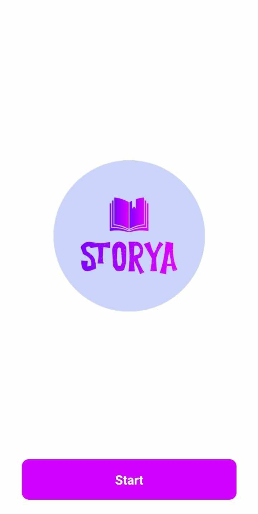
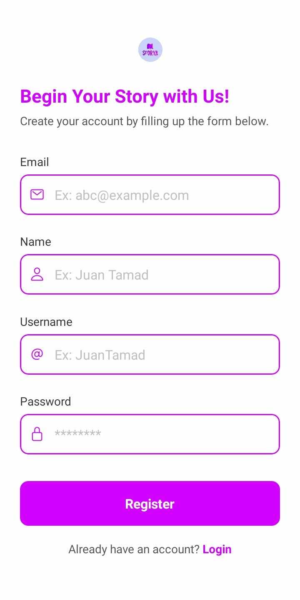
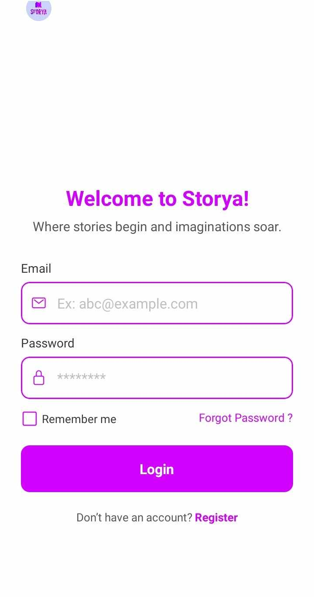
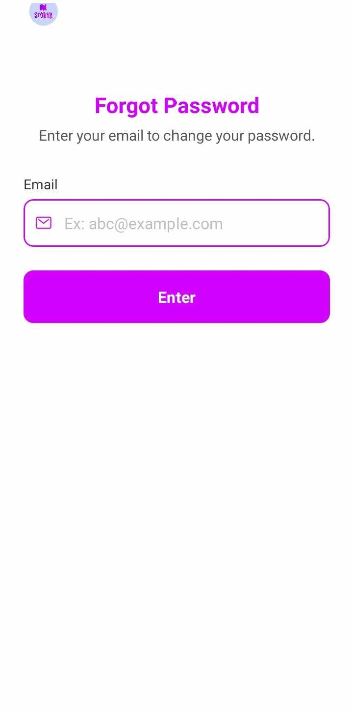
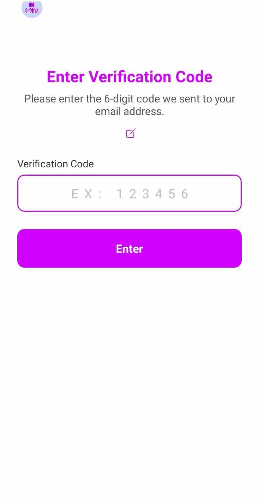
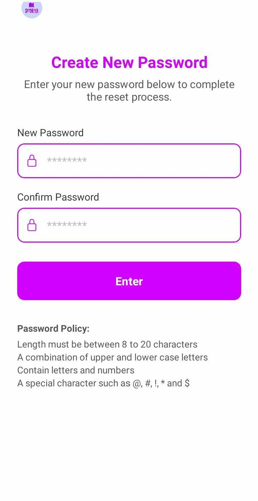
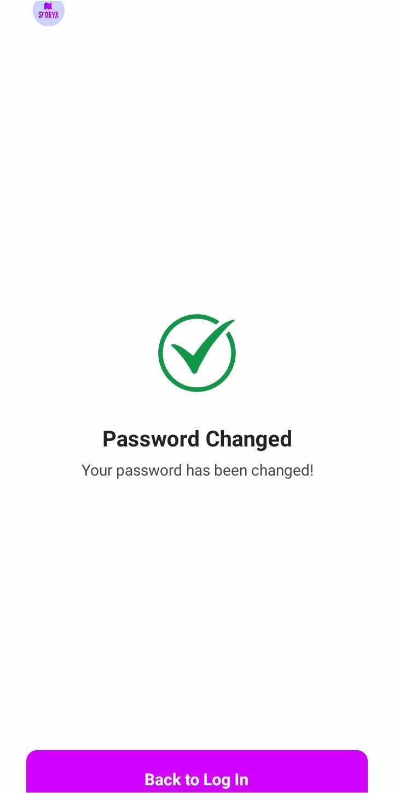
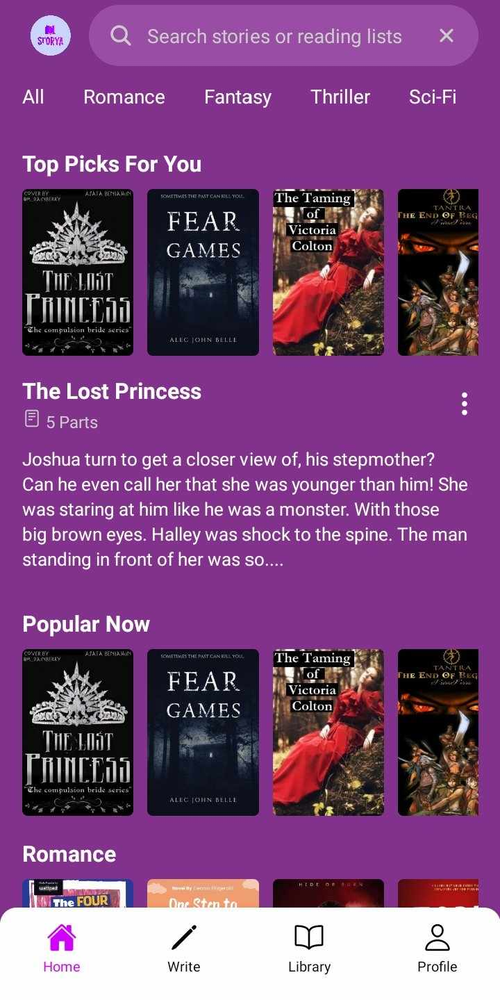

# 📚 Storya - Mobile Novel Reading App

**Storya** is a mobile application designed to let users explore, read, and manage novels in an intuitive and engaging way. With a clean onboarding flow and personalized library features, Storya brings storytelling to the fingertips of every user.

> **🚧 NOTE: The default pin for email verification is 123456**

You may view the **prototype design** here:  
🔗 [Storya Figma Prototype](https://www.figma.com/design/Fqb4S8PGmcxPx1CvbdIJlD/Storya-Prototype?m=dev&t=o6T3wc8pw79iV7Zj-1)

---

## 📲 Features

### 🔐 Authentication
- **Register**: Users can sign up using name, email, and password.
- **Email Verification**: A 6-digit code is sent to users to verify their account (Default pin 123456).
- **Login**: Access with email and password.
- **Forgot Password**: Password reset via email verification and custom password entry.

### 📖 Reading Experience
- **Home Screen**: Features top picks and popular novels categorized by genre (Romance, Fantasy, Thriller, etc.).
- **Book Details**: View summaries and metadata before reading.
- **Book Parts Navigation**: Easily access different chapters.
- **Reading View**: Smooth full-text reader with scroll functionality.

### 📚 Library Management
- **Library**: Save and manage books you are currently reading.
- **Archive**: Store finished or saved books for later reference.

### 👤 Profile
- View basic user information and track saved content.

---
## 🖼️ App Screenshots using ExpoGo

<table>
  <tr>
    <td align="center"><br/>Start Screen</td>
    <td align="center"><br/>Register Screen</td>
    <td align="center"><br/>Login Screen</td>
    <td align="center"><br/>Forgot Password Screen</td>
  </tr>
  <tr>
    <td align="center"><br/>Verification Screen</td>
    <td align="center"><br/>New Password Screen</td>
    <td align="center"><br/>Success Screen</td>
    <td align="center"><br/>Home Screen</td>
  </tr>
</table>

## 📦 Setup & Installation

> _Make sure you have Expo CLI installed_

1. **Clone the repository**
   ```bash
   git clone https://github.com/crisvin03/storya-app.git
   cd storya-app

2. **Install Dependencies**
   ```bash
   npm install

 3. **Set Up Environment Variables**
     Create a file named .env in the root folder and configure your API base URL or other sensitive keys:
    ```env
    API_URL=https://your-api-endpoint.com
    
 4. **Run the App Locally**
    ```bash
    npx expo start

**This will open Expo DevTools in your browser.**

**Scan the QR code using the Expo Go app on your Android/iOS phone.**

**Or press a to run on Android emulator, i for iOS (Mac only).**
